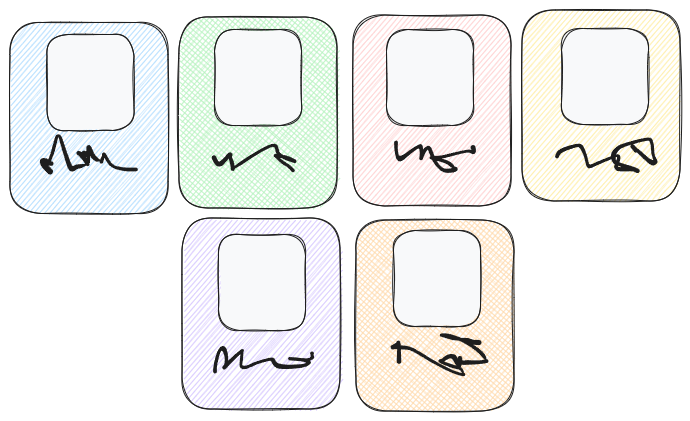

Sometimes you have a grid of items and you want to get the items rearanged dynamically given a fixed number of rows or columns.



*Grid centering sketch.*

This is something that gave me a lot of headache, as grid does not let you auto-center items, the only attributes that have something similar are
`auto-fill` and `auto-fit`, but those relies on expanding to the maximum size depending on the attribute selected. 

So, based on the problem there were two options:
1. Create a grid of 1 row and X columns with auto-fit option and repeat that as many rows as I wanted while adjusting the gap between grids.
2. Take advantage of the flexbox property.

Here, option 2 was the solution.

> Example can be seen at the top-right of the <a href="/about">About</a> page, where 
> a set of SVG elements are positioned dynamically, and everytime a new SVG element is added, items are rearanged.

## Component

First we create a parent `<div>` container and the children `<div>` containers
that act as the items that contains the SVG among other elements.
```astro
---
import Python from '../assets/icons/python.svg';
import JavaScript from '../assets/icons/javascript.svg';
import Git from '../assets/icons/git.svg';
---
<div style="display: flex; flex-wrap: wrap; 
            justify-content:center; gap: 0.5rem;">
    <div style="flex: 0 1 100px; text-align: center; 
                padding:1rem 0rem; user-select: none;">
        <Python width={50} height={50}/>
        <p style="opacity: .5; transition: opacity 0.3s ease;">Python</p>
    </div>
    // --- //
</div>
```
As you can see, the SVG is loaded using `<SVG height={x} width={y}/>` as a tag. This is a cool feature added in Astro starting from [astro@5.7.0](https://docs.astro.build/en/guides/images/#svg-components) version.
This way we do not have to create a dynamically through any tsx or jsx files, just called them with the same name as the SVG file created after importing them.

Also by taking advantage of the [inline style](https://docs.astro.build/en/guides/styling/#inline-styles) attributes in Astro, we can define the basic CSS properties
like using Tailwind.

Regarding CSS properties, we the parent `<div>` to be displayed with a the flex property and the flex-wrap option. This way children can be distributted in as many lines
as possible from the available space.

For the CSS children properties. To make each one with the same space we set them with an space of `100px`, and because the content comes along with a `<p>` tag,
we center them.

To gave a cool and easy effect to each of the child, we can lower the opacity to the text below each SVG, and when the user hover over them, 
make a transition to change the background color and the opacity of the text, as we can see in the code below.
```scss
div:hover {
    background-color: #ff00001a;
}

div:hover p{
    opacity: 1 !important;
}
```
---
## Sources

* https://stackoverflow.com/questions/49514794/centering-grid-items-in-an-auto-fill-container
* https://css-tricks.com/snippets/css/complete-guide-grid/
* https://css-tricks.com/auto-sizing-columns-css-grid-auto-fill-vs-auto-fit/
* https://developer.mozilla.org/en-US/docs/Web/CSS/flex
* https://developer.mozilla.org/en-US/docs/Web/CSS/CSS_flexible_box_layout/Basic_concepts_of_flexbox