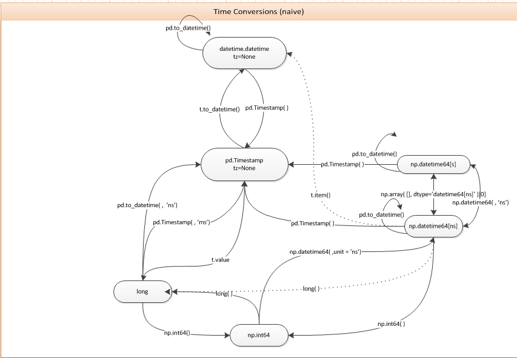

Xarray has been part of the python geospatial, weather and climate ecosystem for a while, up to a point where 
most of the libraries and frameworks such as GDAL, rasterio, dask or rioxarray used as an extension or implementation in a field.

When you work a lot with xarray, reusing some processes are the norm, 
and most of the time we look for on the same forums or documentations.
Instead on relying on the browser history, I decided through this post to put some of the most used for me here, which will be updated from time to time.

## How to concatenate DataArrays by any dimension?
```python
import xarray as xr
import numpy as np
```
```python
import ds1 = xr.DataArray(np.arange(6).reshape(2, 3), [("lon", [4.3, 4.4]), ("lat", [40.44, 40.45, 40.46])])
ds1 = ds1.expand_dims(dim={"time": [np.datetime64('2025-03-14'), np.datetime64('2025-03-15')]})
ds1
PYTHON-OUTPUT
<xarray.DataArray (time: 2, lon: 2, lat: 3)> Size: 96B
array([[[0, 1, 2],
        [3, 4, 5]],
       [[0, 1, 2],
        [3, 4, 5]]])
Coordinates:
  * time     (time) datetime64[s] 16B 2025-03-14 2025-03-15
  * lon      (lon) float64 16B 4.3 4.4
  * lat      (lat) float64 24B 40.44 40.45 40.46
```
```python
ds2 = xr.DataArray(
    np.arange(6).reshape(2, 3), [("lon", [4.3, 4.4]), ("lat", [40.44, 40.45, 40.46])]
)
ds2 = ds2.expand_dims(dim={"time": [np.datetime64('2025-03-16'), np.datetime64('2025-03-17')]})
ds2
PYTHON-OUTPUT
<xarray.DataArray (time: 2, lon: 2, lat: 3)> Size: 96B
array([[[0, 1, 2],
        [3, 4, 5]],
       [[0, 1, 2],
        [3, 4, 5]]])
Coordinates:
  * time     (time) datetime64[s] 16B 2025-03-16 2025-03-17
  * lon      (lon) float64 16B 4.3 4.4
  * lat      (lat) float64 24B 40.44 40.45 40.46
```
```python
ds_merged = xr.concat([ds1, ds2], dim="time")
ds_merged
PYTHON-OUTPUT
<xarray.DataArray (time: 4, lon: 2, lat: 3)> Size: 192B
array([[[0, 1, 2],
        [3, 4, 5]],
       ...
       [[0, 1, 2],
        [3, 4, 5]]])
Coordinates:
  * time     (time) datetime64[s] 32B 2025-03-14 2025-03-15 ... 2025-03-17
  * lon      (lon) float64 16B 4.3 4.4
  * lat      (lat) float64 24B 40.44 40.45 40.46
```

## Convert between datetime, Timestamp and datetime64
Working with dates in python became very frustrating not only because timezones, but also when you are playing with
date conversion between numpy (as datetime standard structure for xarray), pandas and base datetime environment.

For this to be helpful, instead of a detailed blog (which could be done in the future),
I wanted to put the most known entry in [StackOverflow](https://stackoverflow.com/questions/13703720/converting-between-datetime-timestamp-and-datetime64)
with it's associated diagram below.



*Datetime conversion diagram (2014).*

> Although this answer was written in 2014, most of the code flow still remains.

## Clip DataArray to an smaller extent
```python
import xarray as xr
import numpy as np
```
```python
ds = xr.DataArray(
   np.arange(12).reshape(4, 3), [("lon", [4.3, 4.4, 4.5, 4.6]), ("lat", [40.44, 40.45, 40.46])]
)
ds = ds.expand_dims(dim={"time": [np.datetime64('2025-03-14'), np.datetime64('2025-03-15')]})
ds
PYTHON-OUTPUT
<xarray.DataArray (lon: 4, lat: 3)> Size: 96B
array([[ 0,  1,  2],
       [ 3,  4,  5],
       [ 6,  7,  8],
       [ 9, 10, 11]])
Coordinates:
  * lon      (lon) float64 32B 4.3 4.4 4.5 4.6
  * lat      (lat) float64 24B 40.44 40.45 40.46
```
```python
# Order can be changed if ds lat-lon comes in different order
ds.sel(lat=slice(40.44, 40.45), lon=slice(4.4, 4.6))
PYTHON-OUTPUT
<xarray.DataArray (lon: 3, lat: 2)> Size: 48B
array([[ 3,  4],
       [ 6,  7],
       [ 9, 10]])
Coordinates:
  * lon      (lon) float64 24B 4.4 4.5 4.6
  * lat      (lat) float64 16B 40.44 40.45
```

## Convert cftime.DatetimeJulian to datetime[^1].
```python
import pandas as pd
import xarray as xr
import numpy as np
```
```python
ds = xr.DataArray(
   np.arange(12).reshape(4, 3), [("lon", [4.3, 4.4, 4.5, 4.6]), ("lat", [40.44, 40.45, 40.46])]
)
time_range = xr.date_range(start="2025", periods=6, freq="2MS", calendar="noleap", use_cftime=True, name="time")
time_range
PYTHON-OUTPUT
CFTimeIndex([2025-01-01 00:00:00, 2025-03-01 00:00:00, 2025-05-01 00:00:00,
             2025-07-01 00:00:00, 2025-09-01 00:00:00, 2025-11-01 00:00:00],
            dtype='object', length=6, calendar='noleap', freq='2MS')
ds = ds.expand_dims(dim={"time": time_range})
<xarray.DataArray (time: 6, lon: 4, lat: 3)> Size: 576B
array([[[ 0,  1,  2],
        [ 3,  4,  5],
        [ 6,  7,  8],
        [ 9, 10, 11]],
       ...
       [[ 0,  1,  2],
        [ 3,  4,  5],
        [ 6,  7,  8],
        [ 9, 10, 11]]])
Coordinates:
  * time     (time) object 48B 2025-01-01 00:00:00 ... 2025-11-01 00:00:00
  * lon      (lon) float64 32B 4.3 4.4 4.5 4.6
  * lat      (lat) float64 24B 40.44 40.45 40.46
```
```python
ds["time"] = pd.to_datetime(ds["time"].time.astype(str))
PYTHON-OUTPUT
DatetimeIndex(['2025-01-01', '2025-03-01', '2025-05-01', '2025-07-01',
               '2025-09-01', '2025-11-01'],
              dtype='datetime64[ns]', freq=None)
```
We can see more options from xarray [date_range](https://docs.xarray.dev/en/latest/generated/xarray.date_range.html#xarray.date_range) docs.

[^1]: https://stackoverflow.com/a/79443254